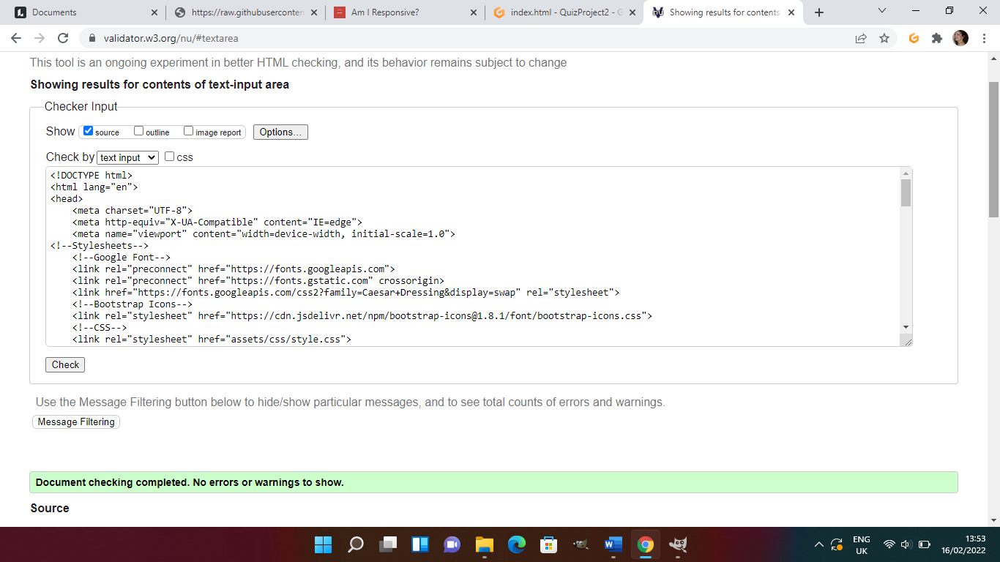
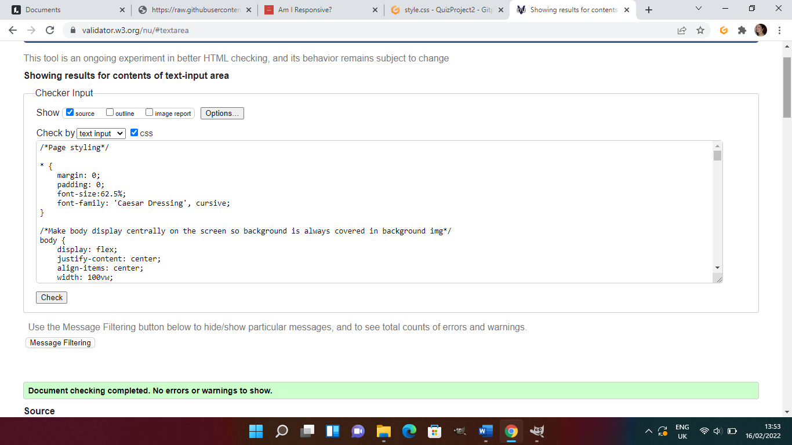
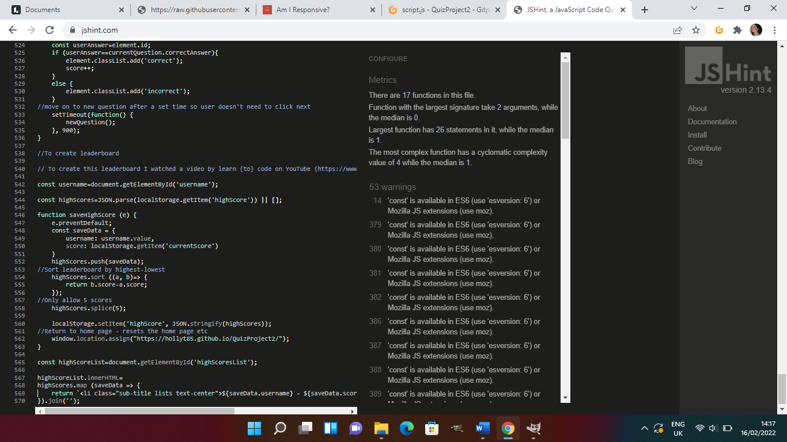
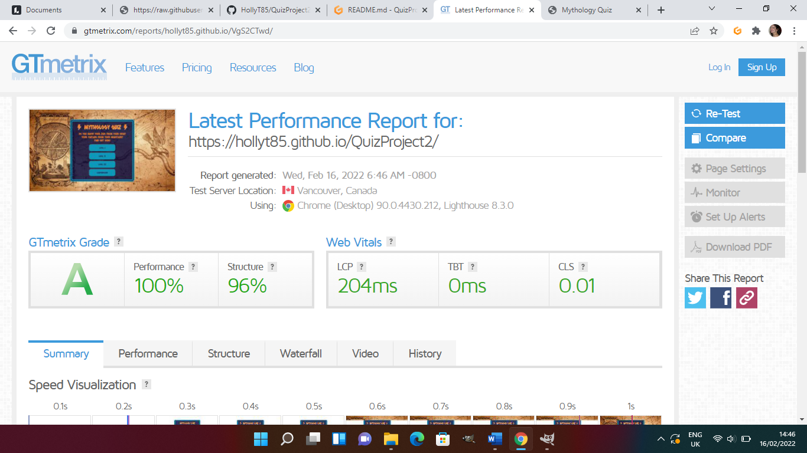
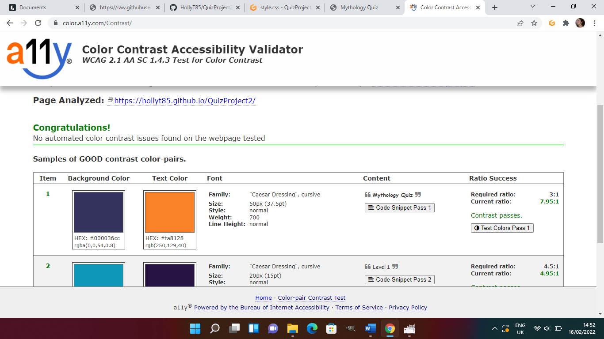

<u><b>Overview</b></u> 

I created a mythology quiz as I wanted to create an interactive game that people could enjoy; it is designed to allow people to both test their knowledge and to create some curiosity about some of the more 'obscure' myths. 

<u><b>Site Overview and UX</b></u>

I created the site using flex (researched via [W3](https://www.w3.org/)) to make it responsive on all screen sizes which; as you can see above, it is. I wanted the quiz area to be centralised vertically on any screen size to ensure a full covering of the background image.

The colours have been chosen to match the background image colour; brown/orange and blue are complimentary colours on the colour wheel so I stuck to this theme as much as possible; the only deviations are the red/green for correct/incorrect answers.

Each new question updates the question number so users can see where they are in the quiz and there is a home page button should a user decide to leave to try a different level if they find it too easy/hard.

Before I started designing my quiz, I did some market research on how people prefer their quizzes to be; initially the majority said they would prefer to only know their score at the end however, when I did this and sent this out to my test group, they had changed their mind and said they would prefer to know if they got a question right/wrong as they went along. They said they did not want to know which was the right answer as, if they were interested, they would go away and research themselves and thus use it as a tool to learn things independently. It was widely felt that by being told the answer, there was no learning involved that would stay in their head and, as such, I changed my design to suit these opinions.

Initially, I also had a next button however, it was decided that it would be preferred to have the screen take you onto the next page by itself; again, I adjusted my code to accomadate this. I changed the time a number of times until 900ms was agreed to be about the right length.

When it came to the results page, I had the score as a percentage however, the research group did not like this; they said they would prefer an actual number and, as such, I changed my design to also reflect this.

<b><u>Home Page</u></b>

This is the first page a user encounters; it is simple and easy to use. I used Roman Numerals for the levels for added myth effect. 

<b><u>Quiz Pages</u></b>

The container changes size to fit the question/answer size and the answer clicked changes colours in response to whether a question is correct/incorrect. For the home button, I used an icon so it wasn't too large and used something that resembled a historical building to fit the theme. 

<b><u>Score Page</u></b>

The score page provides the user with their score and an option to submit their score to be added to the leaderboard; if you do this, after submitting you are automatically sent back to the home page. You can also navigate back to the home page without saving.

<b><u>Leaderboard</u></b>

The leaderboard displays the name and score and also allows access back to the home page.

The quiz has been tested by around 15 people on various devices and all have found it fully functioning on their different devices with no display issues.

<b><u>Wireframes</u></b>

I created my Wireframes on the online site [Lucidchart](https://www.lucidchart.com).

I wanted my design to be the same across all devices (just adjusting for screen size) and, as such, there is only one set.

<u>Home</u> 

<u>Quiz</u> 

<u>End Page</u> 

<b><u>User Stories</u></b>

As a user, I want a quiz that is clear about it's content. 
 

As a user, I want a quiz that is easily navigable on every page. 
 
 
 

As a user, I want to know if I got a question right or wrong at the time of submitting an answer.
As a user, I want to have my knowledge challenged and be encouraged to learn new things. 
 
 

As a user, I want to know my final score in a clear, concise manner. 
 

As a user, I want to be able to compare my score with other players. 
 

<b><u>Testing and Validation</u></b>

I found many bugs whilst testing as did my test group; these ranged from the home button not refreshing the game to styling issues where writing went outside their containers etc. These have now been fixed and the site has been validated. The CSS and HTML has been validated with [W3CValidator](https://validator.w3.org/) and the JS has been through [JSHint](https://jshint.com/). The HTML & CSS found no problems; the JS had warnings regarding const/let being available from ES6. I also conducted a speed test at [GTMetrix](https://gtmetrix.com/) which produced positive results. The colours on my website passed accessibility tests at [a11y](https://color.a11y.com/Contrast/)

<u>HTML Validation</u>

<u>CSS Validation</u>

<u>JS Validation</u>

<u>Speed Test</u>

<u>Colour Contrast</u>

<b><u>Issues and Bugs</u></b>

Throughout this project I have come across a number of bugs; these primarily occurred when transferring several pages of JS and HTML to a single page of each. 

I had difficulty in creating a leaderboard and, as such, watched ten minutes of a tutorial by learn {to} code (link below) to help me create one that is functioning. I discovered when retrieving the score without retrieving it directly from the local storage, the score was always displaying the previous result and not the current one; as such, I decided to collect the score directly from local storage and this resolved the problem.

When attempting to splice an available question from the array of available questions, it kept returning that all questions were gone; as such, I watched a video by the Web Shala (link below) which explained one way of doing this using a second index (I just used one) which helped.

On larger screens, there was a problem with the display as the body of the page was aligned to the top which left blank space at the bottom. I changed this to a flex display with everything centrally aligned; this meant that the background is always filled with the background image and there is no blank space.

<b><u>Deployment</u></b>

The site has been deployed and can be found [here](https://hollyt85.github.io/QuizProject2/).

<b><u>Technology, Languages and Tools</u></b>

The site was created using HTML, CSS and JavaScript.

[GitHub](https://github.com/) for buiding the webpage.

[GitHubPages](https://pages.github.com/) for webpage deployment.

[GoogleFonts](https://fonts.google.com/) for the fonts used in the project.

[BootStrapIcons](https://icons.getbootstrap.com/) for the icons used in this project.

[W3Schools](https://www.w3schools.com/) for information regarding flex displays.

[GIMPSoftware](https://www.gimp.org/) to edit photos.

[GTMetrix](https://gtmetrix.com/) to check site speed.

[W3C](https://www.w3.org/) for code validation and also some hints and tips.

[AmIResponsive](http://ami.responsivedesign.is/#) to check responsivity of the site.

[JSHint](https://jshint.com/) to check JavaScript code.

[a11y](https://color.a11y.com/Contrast/) to check accessibility of colours.

[Lucidchart](https://www.lucidchart.com) for creating my wireframe.

[TheWebShala](https://www.youtube.com/watch?v=QU6z69P5BrU&t=820s) for help with fixing my splicing problem.

[learn{to}code](https://www.youtube.com/watch?v=icb9AUBeznQ) from 1hr 30- 1hr 40 to help with my leaderboard problems.

<b><u>Media</u></b>

My background image is from:<a href="https://pixabay.com/users/darkmoon_art-1664300/?utm_source=link-attribution&amp;utm_medium=referral&amp;utm_campaign=image&amp;utm_content=3408811">Darkmoon_Art</a> from <a href="https://pixabay.com/?utm_source=link-attribution&amp;utm_medium=referral&amp;utm_campaign=image&amp;utm_content=3408811">Pixabay</a>

<b><u>Acknowledgements</u></b>

With special thanks to James at Code Institute tutors who helped me see the glaringly obvious and to my daughter (the mythology expert) for creating such amazing (sometimes slightly impossible) questions.