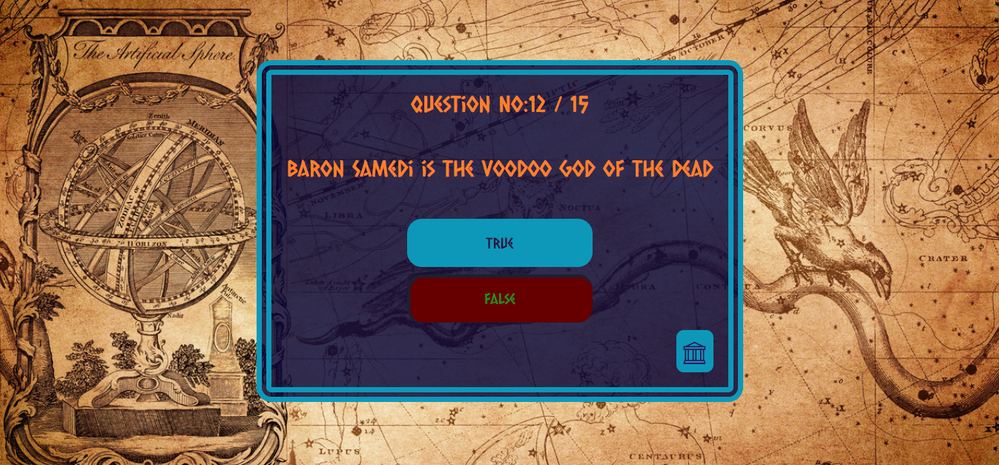
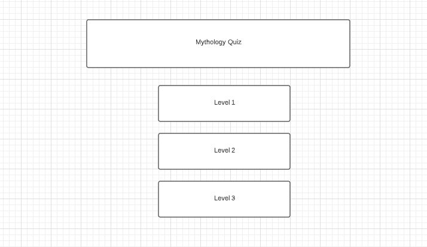

<u><b>Overview</b></u> 
I created a mythology quiz as I wanted to create an interactive game that people could enjoy; it is designed to allow people to both test their knowledge and to create some curiosity about some of the more 'obscure' myths. 

<u><b>Site Overview & UX</b></u>

I created the site using flex (researched via [W3](https://www.w3.org/)) to make it responsive on all screen sizes which; as you can see above, it is. I wanted the quiz area to be centralised vertically on any screen size to ensure a full covering of the background image.

The colours have been chosen to match the background image colour; brown/orange and blue are complimentary colours on the colour wheel so I stuck to this theme as much as possible; the only deviations are the red/green for correct/incorrect answers.

Each new question updates the question number so users can see where they are in the quiz and there is a home page button should a user decide to leave to try a different level if they find it too easy/hard.

Before I started designing my quiz, I did some market research on how people prefer their quizzes to be; initially the majority said they would prefer to only know their score at the end however, when I did this and sent this out to my test group, they had changed their mind and said they would prefer to know if they got a question right/wrong as they went along. They said they did not want to know which was the right answer as, if they were interested, they would go away and research themselves and thus use it as a tool to learn things independently. It was widely felt that by being told the answer, there was no learning involved that would stay in their head and, as such, I changed my design to suit these opinions.

Initially, I also had a next button however, it was decided that it would be preferred to have the screen take you onto the next page by itself; again, I adjusted my code to accomadate this. I changed the time a number of times until 900ms was agreed to be about the right length.

When it came to the results page, I had the score as a percentage however, the research group did not like this; they said they would prefer an actual number and, as such, I changed my design to also reflect this.

<b><u>Home Page</u></b>

This is the first page a user encounters; it is simple and easy to use. I used Roman Numerals for the levels for added myth effect. 

<b><u>Quiz Pages</u></b>

The container changes size to fit the question/answer size and the answer clicked changes colours in response to whether a question is correct/incorrect. For the home button, I used an icon so it wasn't too large and used something that resembled a historical building to fit the theme. 

<b><u>Score Page</u></b>

The score page provides the user with their score and an option to submit their score to be added to the leaderboard; if you do this, after submitting you are automatically sent back to the home page. You can also navigate back to the home page without saving.

<b><u>Leaderboard</u></b>

The leaderboard displays the name and score and also allows access back to the home page.

The quiz has been tested by around 15 people on various devices and all have found it fully functioning on their different devices with no display issues.

<b><u>Wireframes</u></b>

I created my Wireframes on the online site Lucidchart.

I wanted my design to be the same across all devices (just adjusting for screen size) and, as such, there is only one set.

<u>Home</u> 

<u>Quiz</u> 

<u>End Page</u> 

<b><u>User Stories</u></b>

As a user, I want a quiz that is clear about it's content. 
 

As a user, I want a quiz that is easily navigable on every page. 
 
 
 

As a user, I want to know if I got a question right or wrong at the time of submitting an answer.
As a user, I want to have my knowledge challenged and be encouraged to learn new things. 
 
 

As a user, I want to know my final score in a clear, concise manner. 
 

As a user, I want to be able to compare my score with other players. 
 

<b><u>Testing & Validation</u></b>

I found many bugs whilst testing as did my test group; these ranged from the home button not refreshing the game to styling issues where writing went outside their containers etc. These have now been fixed and the site has been validated. The CSS and HTML has been validated with

background image: Image by <a href="https://pixabay.com/users/darkmoon_art-1664300/?utm_source=link-attribution&amp;utm_medium=referral&amp;utm_campaign=image&amp;utm_content=3408811">Darkmoon_Art</a> from <a href="https://pixabay.com/?utm_source=link-attribution&amp;utm_medium=referral&amp;utm_campaign=image&amp;utm_content=3408811">Pixabay</a>